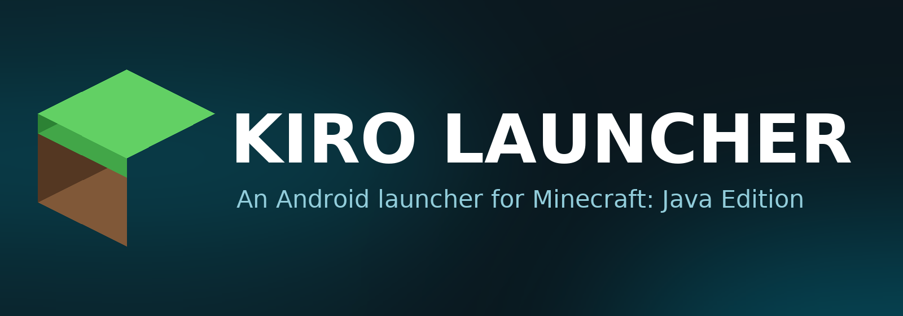

# Kiro Launcher

<p align="center">
  
</p>

<p align="center">
  <a href="https://github.com/MeYashverma/Kiro/releases"></a>
  <a href="https://github.com/MeYashverma/Kiro/actions/workflows/push_ci.yml"></a>
  <a href="https://github.com/MeYashverma/Kiro/blob/main/LICENSE"></a>
  
</p>

[简体中文](README.md) | [English](README_EN_US.md)

**Kiro Launcher**（簡稱 **Kiro**）是一款面向 **Android 裝置** 的 [Minecraft: Java Edition](https://www.minecraft.net/) 啟動器。
它以 [PojavLauncher](https://github.com/PojavLauncherTeam/PojavLauncher/tree/v3_openjdk/app_pojavlauncher/src/main/jni) 作為啟動核心，
介面以 **Jetpack Compose** 與 **Material Design 3** 打造，並擁有獨立的 Kiro 視覺識別（配色、圖示、啟動畫面與應用內品牌）。

> [!IMPORTANT]
> Kiro 是 **[Zalith Launcher 2](https://github.com/ZalithLauncher/ZalithLauncher2)** 的**非官方修改版（分支）**。
> 啟動核心、渲染器框架與絕大多數程式碼皆由 Zalith Launcher 2 的作者 **MovTery** 與貢獻者開發，採用 GNU GPL v3 授權。
> Kiro 與 Zalith Launcher 專案**沒有隸屬、贊助或背書關係**。
> Kiro 並非從零開始撰寫，也不主張擁有上游程式碼的著作權。

## ✨ 主要功能

| 功能 | 說明 |
| --- | --- |
| 遊戲安裝與管理 | 原版遊戲下載安裝、多版本隔離、版本匯出與整合包匯入 |
| 模組載入器 | Forge、NeoForge、Fabric、Quilt、Legacy Fabric、OptiFine、Cleanroom |
| 模組 / 資源包 / 光影 | 瀏覽、安裝、更新、啟用與停用，支援 Modrinth 與 CurseForge 檢索 |
| Java 執行環境 | 內建 JRE 8 / 17 / 21 / 25，支援自訂執行環境匯入 |
| 渲染器 | Vulkan、Zink/Kopper、GL4ES、NG-GL4ES、LTW，並相容 FCL 與上游渲染器外掛 |
| 操作方式 | 觸控佈局編輯器、手把對應、陀螺儀、滑鼠與觸控板模式 |
| 帳號 | 微軟登入、離線帳號、第三方驗證伺服器、外觀與披風管理 |
| 多人遊戲 | 伺服器清單管理與 Terracotta 連線支援 |
| 檔案管理 | 內建檔案管理器、壓縮檔處理與存檔備份 |

## 📦 建置方式（開發者）

### 環境需求

* Android Studio（支援 AGP 9 / Gradle 9.5）
* Android SDK：**最低 API 26**（Android 8.0）、**目標 API 34**
* 建置 Gradle 需 JDK 21

### 支援的架構

Kiro 針對以下 ABI 分別打包：`arm64-v8a`、`armeabi-v7a`、`x86`、`x86_64`，
以及包含全部架構的 `all` 套件。可透過 `-Darch=` 只建置單一架構：

```bash
# 全部架構（預設）
./gradlew KiroLauncher:assembleDebug

# 僅 arm64
./gradlew KiroLauncher:assembleDebug -Darch=arm64
```

### 建置步驟

```bash
git clone https://github.com/MeYashverma/Kiro.git
cd Kiro
./gradlew KiroLauncher:assembleDebug
```

產物位於 `KiroLauncher/build/outputs/apk/`。

發行版使用 `KiroLauncher/kiro_launcher.jks` 簽署，請以環境變數
`STORE_PASSWORD`、`KEY_PASSWORD` 提供密碼。選用設定（環境變數或
`KiroLauncher/gradle.properties`）：`OAUTH_CLIENT_ID`、`CURSEFORGE_API_KEY`、
`url_update_manifest`（應用內更新來源，留空即停用更新檢查）。

## 🔁 從 Zalith Launcher 2 遷移

Kiro 使用自己的 Android 應用 ID（`io.github.meyashverma.kiro`，除錯版本为
`…kiro.debug`）；Java/Kotlin 命名空间沿用上游，以確保 JNI 与外掛相容。
由于 Android 把不同的應用 ID 視為不同的应用：

* Kiro 与 Zalith Launcher 2 **可以並存安装**，不会改動或刪除对方的任何資料。
* 實例、帳號与設定保存在 Kiro 自己的儲存中。如需遷移已有内容，可在
  **設定 → 遊戲目錄** 中指向同一个遊戲目錄，或在版本選單中匯出/匯入實例。
* 已经存在于磁盘上的内部檔案名与鍵名（實例状态檔案 `zalith-game.cfg`、
  外掛元資料键 `zalithRendererPlugin`、环境变量 `ZALITH_VERSION_CODE` 等）
  刻意保持不变，以便已有實例、外掛与模組继续可用。

## 🎨 品牌與視覺資源

<p align="center">
  
</p>

Kiro 的圖示、啟動畫面與文件圖形皆由同一支腳本產生，
調整配色或幾何後重新執行即可同步全部資源：

```bash
python3 tools/generate_kiro_icons.py
```

## 📜 License

本專案採用 **[GPL-3.0 license](LICENSE)** 授權。
Kiro 以 Zalith Launcher 2 的修改版本形式發佈，保留上游的著作權聲明與授權條款。

### 附加條款（依 GPLv3 第七條）

1. 分發修改版本時，必須以合理方式修改名稱或版本號，以示與原始版本不同。
2. 不得移除程式所顯示的著作權聲明（依 GPLv3 7(b)）。

### 上游專案與鳴謝

* [Zalith Launcher 2](https://github.com/ZalithLauncher/ZalithLauncher2) — 直接上游，GPL-3.0
* [PojavLauncher](https://github.com/PojavLauncherTeam/PojavLauncher) — 啟動後端，LGPL-3.0
* [Fold Craft Launcher](https://github.com/FCL-Team/FoldCraftLauncher)、[Hello Minecraft! Launcher](https://github.com/HMCL-dev/HMCL) — 部分實作參考與程式碼
* [BMCLAPI](https://bmclapi2.bangbang93.com/)、[MCIM](https://www.mcimirror.top/) — 下載鏡像
* 所有參與翻譯、回報問題與測試的貢獻者

完整的第三方元件清單可見應用內 **設定 → 關於 → 鳴謝 / 額外引入的依賴項目**。

## 引用开源项目

本软件使用以下开源库:

| Library                               | Copyright                                                                                                     | License              | Official Link                                                                     |
|---------------------------------------|---------------------------------------------------------------------------------------------------------------|----------------------|-----------------------------------------------------------------------------------|
| androidx-appcompat                    | Copyright © The Android Open Source Project                                                                   | Apache 2.0           | [链接↗](https://developer.android.com/jetpack/androidx/releases/appcompat)         |
| androidx-constraintlayout-compose     | Copyright © The Android Open Source Project                                                                   | Apache 2.0           | [链接↗](https://developer.android.com/develop/ui/compose/layouts/constraintlayout) |
| androidx-webkit                       | Copyright © The Android Open Source Project                                                                   | Apache 2.0           | [链接↗](https://developer.android.com/jetpack/androidx/releases/webkit)            |
| ANGLE                                 | Copyright 2018 The ANGLE Project Authors                                                                      | BSD 3-Clause License | [链接↗](http://angleproject.org/)                                                  |
| Apache Commons Codec                  | -                                                                                                             | Apache 2.0           | [链接↗](https://commons.apache.org/proper/commons-codec)                           |
| Apache Commons Compress               | -                                                                                                             | Apache 2.0           | [链接↗](https://commons.apache.org/proper/commons-compress)                        |
| Apache Commons IO                     | -                                                                                                             | Apache 2.0           | [链接↗](https://commons.apache.org/proper/commons-io)                              |
| ByteHook                              | Copyright © 2020-2024 ByteDance, Inc.                                                                         | MIT License          | [链接↗](https://github.com/bytedance/bhook)                                        |
| BuildKeys                             | Copyright © 2026 MovTery                                                                                      | Aoache 2.0           | [链接↗](https://github.com/MovTery/BuildKeys)                                      |
| Coil Compose                          | Copyright © 2025 Coil Contributors                                                                            | Apache 2.0           | [链接↗](https://github.com/coil-kt/coil)                                           |
| Coil Gifs                             | Copyright © 2025 Coil Contributors                                                                            | Apache 2.0           | [链接↗](https://github.com/coil-kt/coil)                                           |
| Coil SVG                              | Copyright © 2025 Coil Contributors                                                                            | Apache 2.0           | [链接↗](https://github.com/coil-kt/coil)                                           |
| Fishnet                               | Copyright © 2025 Kyant                                                                                        | Apache 2.0           | [链接↗](https://github.com/Kyant0/Fishnet)                                         |
| gl4es_extra_extra                     | Copyright © 2016-2018 Sebastien Chevalier; Copyright (c) 2013-2016 Ryan Hileman                               | MIT License          | [链接↗](https://github.com/PojavLauncherTeam/gl4es_extra_extra)                    |
| Gson                                  | Copyright © 2008 Google Inc.                                                                                  | Apache 2.0           | [链接↗](https://github.com/google/gson)                                            |
| kotlinx.coroutines                    | Copyright © 2000-2020 JetBrains s.r.o.                                                                        | Apache 2.0           | [链接↗](https://github.com/Kotlin/kotlinx.coroutines)                              |
| ktor-client-content-negotiation       | Copyright © 2000-2023 JetBrains s.r.o.                                                                        | Apache 2.0           | [链接↗](https://ktor.io)                                                           |
| ktor-client-core                      | Copyright © 2000-2023 JetBrains s.r.o.                                                                        | Apache 2.0           | [链接↗](https://ktor.io)                                                           |
| ktor-client-okhttp                    | Copyright © 2000-2023 JetBrains s.r.o.                                                                        | Apache 2.0           | [链接↗](https://ktor.io)                                                           |
| ktor-http                             | Copyright © 2000-2023 JetBrains s.r.o.                                                                        | Apache 2.0           | [链接↗](https://ktor.io)                                                           |
| ktor-serialization-kotlinx-json       | Copyright © 2000-2023 JetBrains s.r.o.                                                                        | Apache 2.0           | [链接↗](https://ktor.io)                                                           |
| LWJGL - Lightweight Java Game Library | Copyright © 2012-present Lightweight Java Game Library All rights reserved.                                   | BSD 3-Clause License | [链接↗](https://github.com/LWJGL/lwjgl3)                                           |
| material-color-utilities              | Copyright 2021 Google LLC                                                                                     | Apache 2.0           | [链接↗](https://github.com/material-foundation/material-color-utilities)           |
| Maven Artifact                        | Copyright © The Apache Software Foundation                                                                    | Apache 2.0           | [链接↗](https://github.com/apache/maven/tree/maven-3.9.9/maven-artifact)           |
| Media3                                | Copyright © The Android Open Source Project                                                                   | Apache 2.0           | [链接↗](https://developer.android.com/jetpack/androidx/releases/media3)            |
| Mesa                                  | Copyright © The Mesa Authors                                                                                  | MIT License          | [链接↗](https://mesa3d.org/)                                                       |
| MMKV                                  | Copyright © 2018 THL A29 Limited, a Tencent company.                                                          | BSD 3-Clause License | [链接↗](https://github.com/Tencent/MMKV)                                           |
| Navigation 3                          | Copyright © The Android Open Source Project                                                                   | Apache 2.0           | [链接↗](https://developer.android.com/jetpack/androidx/releases/navigation3)       |
| NG-GL4ES                              | Copyright © 2016-2018 Sebastien Chevalier; Copyright © 2013-2016 Ryan Hileman; Copyright (c) 2025-2026 BZLZHH | MIT License          | [链接↗](https://github.com/BZLZHH/NG-GL4ES)                                        |
| OkHttp                                | Copyright © 2019 Square, Inc.                                                                                 | Apache 2.0           | [链接↗](https://github.com/square/okhttp)                                          |
| Okio                                  | Copyright © 2013 Square, Inc.                                                                                 | Apache 2.0           | [链接↗](https://square.github.io/okio/)                                            |
| OpenNBT                               | Copyright © 2013-2021 Steveice10.                                                                             | MIT License          | [链接↗](https://github.com/GeyserMC/OpenNBT)                                       |
| Process Phoenix                       | Copyright © 2015 Jake Wharton                                                                                 | Apache 2.0           | [链接↗](https://github.com/JakeWharton/ProcessPhoenix)                             |
| proxy-client-android                  | -                                                                                                             | LGPL-3.0 License     | [链接↗](https://github.com/TouchController/TouchController)                        |
| Reorderable                           | Copyright © 2023 Calvin Liang                                                                                 | Apache 2.0           | [链接↗](https://github.com/Calvin-LL/Reorderable)                                  |
| sdl2-compat                           | Copyright (C) 2026 Sam Lantinga <slouken@libsdl.org>                                                          | Zlib License         | [链接↗](https://github.com/libsdl-org/sdl2-compat)                                 |
| SDL3                                  | Copyright (C) 1997-2026 Sam Lantinga <slouken@libsdl.org>                                                     | Zlib License         | [链接↗](https://github.com/libsdl-org/SDL)                                         |
| skinview3d                            | Copyright © 2014-2018 Kent Rasmussen; Copyright © 2017-2022 Haowei Wen, Sean Boult and contributors           | MIT License          | [链接↗](https://github.com/bs-community/skinview3d)                                |
| sora-editor                           | Copyright (C) 2020-2026  Rosemoe                                                                              | LGPL-2.1 License     | [链接↗](https://github.com/Rosemoe/sora-editor)                                    |
| StringFog                             | Copyright © 2016-2023, Megatron King                                                                          | Apache 2.0           | [链接↗](https://github.com/MegatronKing/StringFog)                                 |
| tm4e (TextMate for Eclipse)           | Copyright © Eclipse Foundation                                                                                | EPL-2.0 License      | [链接↗](https://github.com/eclipse-tm4e/tm4e)                                      |
| XZ for Java                           | Copyright © The XZ for Java authors and contributors                                                          | 0BSD License         | [链接↗](https://tukaani.org/xz/java.html)                                          |